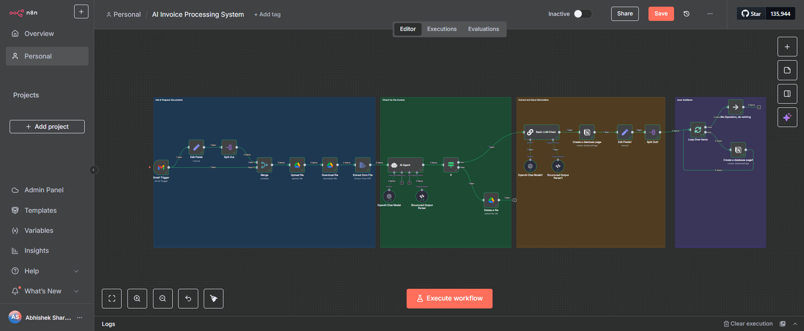

# AI Invoice Processing System (n8n + OpenAI + Gmail + Notion)

## Problem
Manually processing invoices from email attachments is slow, repetitive, and prone to human error. Businesses waste hours each week downloading PDFs, extracting data, and updating finance records.

## Solution (n8n)

- Gmail Trigger: captures incoming emails with PDF invoices.
- Google Drive Upload/Download: stores and retrieves invoice files.
- Extract JSON from File: parses invoice PDF content.
- AI Agent (OpenAI + Structured Parser): extracts key fields (Invoice No, Date, Vendor, Amount).
- Conditional Check: validates data quality.
- Notion Database: saves invoice records for tracking and reporting.
- File Cleanup: deletes processed files after logging.

## Result

- Eliminates manual invoice entry.
- Ensures structured financial data is always available in Notion.
- Saves ~4–6 hours/month for small teams (scales higher for enterprises).
- Reduces errors by applying AI validation.

## Stack

- n8n (workflow automation)
- Gmail (invoice intake)
- Google Drive (file storage)
- OpenAI (field extraction + structured parsing)
- Notion (invoice database + reporting)

## How to Run (Demo)

1. Import workflow.json into n8n (this export is sanitized; set your own credentials).
2. Connect Gmail, Google Drive, OpenAI, and Notion credentials.
3. In Notion, create a database with fields: Invoice No, Date, Vendor, Amount.
4. Update node IDs/URLs in the workflow to match your setup.
5. Send a test email with a sample PDF invoice to trigger the flow.

## Repo Structure
```
/
├─ README.md
├─ workflow.json            # sanitized; no secrets
├─ /screenshots             # add 2–4 PNGs (flow overview & success logs)
├─ /sample-data             # example payloads (JSON/CSV)
└─ LICENSE                  # MIT license
```

## Screenshots


## Notes on Credentials & Safety
- This repo does **not** include secrets. Configure credentials inside n8n.
- Replace any test tokens/IDs with your own before running.
